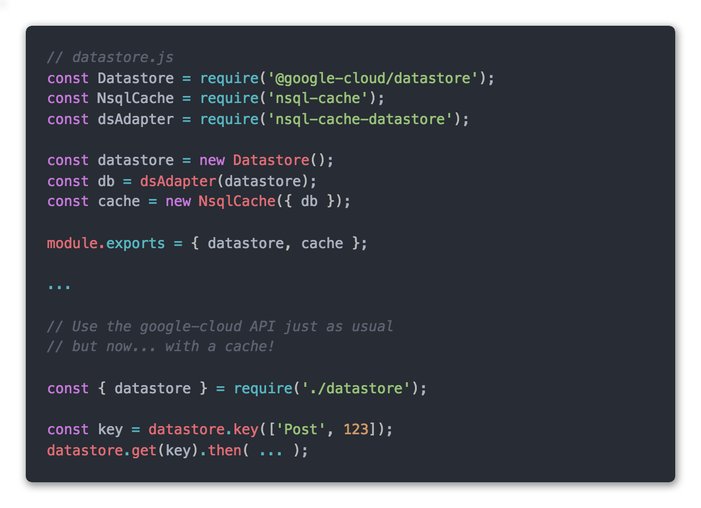

# Google Datastore adapter for Nsql Cache

[![NPM Version][npm-image]][npm-url]

[**Installation**](#installation) |
[**Usage**](#usage) |
[**Advanced**](#advanced-usage-cache-not-managed) |
[**API**](#api) |
[**Support**](../../issues)

This is the [nsql-cache](https://github.com/sebelga/nsql-cache) database adapter for Google Datastore.
See the [Medium article](https://medium.com/p/ffb402cd0e1c/edit) for an in-depth overview of nsql-cache.



## Installation

```sh
npm install nsql-cache nsql-cache-datastore --save
# or
yarn add nsql-cache nsql-cache-datastore
```

**Info:** nsql-cache-datastore is integrated in **[gstore-node](https://github.com/sebelga/gstore-node)**. If you are not (yet) using gstore-node to model your Datastore entities, have a look at the project to see what you're missing!

## Usage

### Default (managed)

By default nsql-cache **wraps** the database client to automatically manage the cache for you. If you have specific needs and you prefer to manage the cache yourself, look at the [advanced section below](#advanced-usage-cache-not-managed).  

Let's start by creating a separate file for the datastore and cache instantiation.

```js
// datastore.js

const Datastore = require('@google-cloud/datastore');
const GstoreCache = require('nsql-cache');
const dsAdapter = require('nsql-cache-datastore');

const datastore = new Datastore({ ...your config });
const db = dsAdapter(datastore);
const cache = new GstoreCache({ db });

module.exports = { datastore, cache };
```

Great! You now have a LRU memory cache with the following configuration:

- Maximum number of objects in cache: 100
- TTL (time to live) for entities (_Key_ fetch): 10 minutes
- TTL for queries: 5 second


To see how you can configure NsqlCache, please refer to its [API documentation](https://github.com/sebelga/nsql-cache#api).

### Examples

> Info: In all the examples below, the error handling has been omitted for brevity.

```js
const { datastore } = require('./datastore');

/**
 * The getUser() method will
 * - check the cache to see if User with the provided id is there
 * - if not, it will get it from the Datastore
 * - then it will prime the cache with the entity data fetched
 */
const getUser = (id) => {
    const key = datastore.key(['User', id]);
    return datastore.get(key);
};

/**
 * The saveUser() method will
 * - save the entity in the Datastore
 * - prime the cache with the data
 *
 * Note: the same behaviour occurs with update(), insert() and upsert()
 */
const saveUser = (data) => {
    const key = datastore.key(['User']);
    return datastore.save({ key, data });
};

/**
 * The deleteUser() method will
 * - delete the entity from the Datastore
 * - remove it from the cache
 */
const deleteUser = (id) => {
    const key = datastore.key(['User', id]);
    return datastore.delete(key);
};
```

As you can see, once you have initialized the cache you don't need to worry too much about it.  You use the @google-cloud/datastore API the exact same way.  

One **important feature** to highlight is that when you do a _batch_ fetch of entities keys, nsql-cache will first look into the cache for the keys and it will _only_ go and fetch from the Datastore **the keys not in the cache**.

```js
const key1 = datastore.key(['User1', 123]); // in cache
const key2 = datastore.key(['User1', 456]); // in cache
const key3 = datastore.key(['User1', 789]);

// The following will only ask the Datastore for the key3
const users = await datastore.get([key1, key2, key3]);
```

#### Disable the cache or change the TTL on a request

The examples below are using the `datastore.get()` method, but the **same options** applies for `save()`, `update()`, `insert()`

```js
// Bypass the cache and go directly to the Datastore
const getUser = (id) => {
    const key = datastore.key(['User', id]);
    return datastore.get(key, { cache: false });
};

// Change the expiration of the cache
// Info: ttl of 0 === infinite cache
const getUser = (id) => {
    const key = datastore.key(['User', id]);
    return datastore.get(key, { cache: { ttl: 10 } });
};
```

#### Queries

Queries are automatically catched after each successful run().

```js

const { datastore } = require('./datastore');

const query = datastore.createQuery('User')
                .filter('age', '>', 18)
                .limit(10);

/**
 * The quer.run() will
 * - check the cache to see if this same query is there
 * - if not, it will run it on the Datastore
 * - then it will prime the cache with the result of the query
 */
await query.run();
```

Again, there is no difference with what you are already doing with the @google-cloud/datastore API.

##### Disable the cache or change the TTL of a query

Just like with Keys, there is one additional configuration to the optional `options` argument to disable the cache _or_ change the TTL.

```js
await query.run({ cache: false });
await query.run({ cache: { ttl: 300 } });
```

As you might have noticed in the default configuration, queries have a very short TTL (5 seconds). This is because as soon as we create, update or delete an entity, any query that we have cached might be out of sync.  
Depending on the usecase, 5 seconds might be acceptable or not. Remember that you can always disable the cache or lower the TTL on specific queries. You might also decide that you never want queries to be cached, in such case set the global TTL duration for queries to **-1**.  

But there is a better way: provide a **_Redis_ client**. Have a look at [the nsql documentation about multi store](https://github.com/sebelga/nsql-cache#multi-cache-stores) to see how to achieve that.

## Advanced usage (cache not managed)

If you don't want the datastore client to be wrapped, you can disable the behaviour.  
You are then responsible to add and remove data to/from the cache.  

```js
...

const cache = gstoreCache.init({
    db,
    config: {
        wrapClient: false
    }
});
```

Now let's see how you can manage the cache.

### Datastore \<Key\>

#### cache.keys.read()

```js
const { datastore, cache } = require('./datastore');
const key = datastore.key(['Company', 'Google']);

/**
 * The "cache.keys.read()" helper will
 * - Look for the entity in the cache
 * - If not found, fetch it from the Datastore
 * - Prime the cache with the entity fetched from the Datastore.
 */
cache.keys.read(key).then(entity => {
    console.log(entity);
    console.log(entity[datastore.KEY]); // the Key Symbol is added to the cached results
});
```

It looks very similar to the _wrapped_ client. The difference is here we are calling the `cache.keys` API.

```js
/**
 * You can also pass several keys to the read() method
 * nsql-cache will first check the cache and only fetch from the Datastore
 * the keys that were *not* found in the cache.
 *
 * In the example below, only the "key3" would be passed to datastore.get() and
 * fetched from the Datastore
 */
const key1 = datastore.key(['Task', 123]); // this entity is in the cache
const key2 = datastore.key(['Task', 456]); // this entity is in the cache
const key3 = datastore.key(['Task', 789]);

cache.keys.read([key1, key2, key3]).then(entities => {
    console.log(entities[0]);
    console.log(entities[1]);
    console.log(entities[2]);
});
```

The `cache.keys.read()` helper is syntactic sugar for the following:

```js
const { datastore, cache } = require('./datastore');
const key = datastore.key(['Company', 'Google']);

cache.keys
    .get(key) // check the cache
    .then(cacheEntity => {
        if (cacheEntity) {
            // Cache found... great!
            return cacheEntity;
        }

        // Fetch from the Datastore
        return datastore.get(key).then(response => {
            const [entity] = response;

            // Prime the cache
            return cache.keys.set(key, entity);
        });
    })
    .then(entity => {
        console.log(entity);
    });
```

### Datastore \<Query\>

#### cache.queries.read()

```js
const { datastore, cache } = require('./datastore');

const query = datastore
    .createQuery('Post')
    .filter('category', 'tech')
    .order('updatedOn')
    .limit(10);

/**
 * Just like with the Keys, the "queries.read()" helper will
 * - Look for the query in the cache
 * - If not found, run the query on the Datastore
 * - Prime the cache with the response from the query.
 */
cache.queries.read(query).then(response => {
    const [entities, meta] = response;

    console.log(entities);
    console.log(entities[0][datastore.KEY]); // KEY Symbol are saved in cache
    console.log(meta.moreResults);
});
```

The `gstoreInstance.queries.read()` helper is syntactic sugar for the following:

```js
const { datastore, cache } = require('./datastore');

const query = datastore
    .createQuery('Post')
    .filter('category', 'tech')
    .order('updatedOn')
    .limit(10);

cache.queries
    .get(query) // check the cache
    .then(cacheData => {
        if (cacheData) {
            // Cache found... great!
            return cacheData;
        }

        // Run the query on the Datastore
        return query.run().then(response => {
            // Prime the cache.
            return cache.queries.set(query, response);
        });
    })
    .then(response => {
        const [entities, meta] = response;
    });
```

### With a Redis client

When you save a Query in the cache _and_ you have provided a Redis client, nsql-cache will automatically save a **reference** to this query in a Redis _**Set**_.  
So how do you invalidate the cache?

#### `cache.queries.clearQueriesByKind(entityKinds)`

You need to call `clearQueriesByKind` each time you add, update or delete an entity.

```js
const { datastore, cache } = require('./datastore');

// Each time you save a new "Posts" Entity Kind,
// You now need to invalidate the queries cache for "Posts"

const key = datastore.key(['Posts']);
const data = { title: 'My Post' };

datastore.save({ key, data })
    .then(() => {
        // invalidate all the queries for "Posts" Entity Kind
        cache.queries.clearQueriesByKind(['Posts'])
            .then(() => {
                // All the Posts queries have been removed from the Redis cache
            });
    });
```

## API

See the [nsql-cache API documentation](https://github.com/sebelga/nsql-cache#api).

## Meta

Sébastien Loix – [@sebloix](https://twitter.com/sebloix)

Distributed under the MIT license. See `LICENSE` for more information.

[https://github.com/sebelga](https://github.com/sebelga/)  

<!-- Markdown link & img dfn's -->

[npm-image]: https://img.shields.io/npm/v/nsql-cache-datastore.svg?style=flat-square
[npm-url]: https://npmjs.org/package/nsql-cache-datastore
